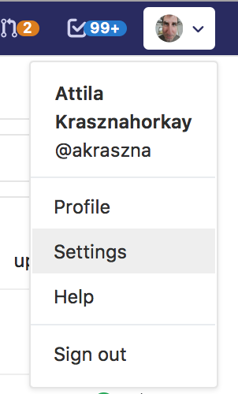
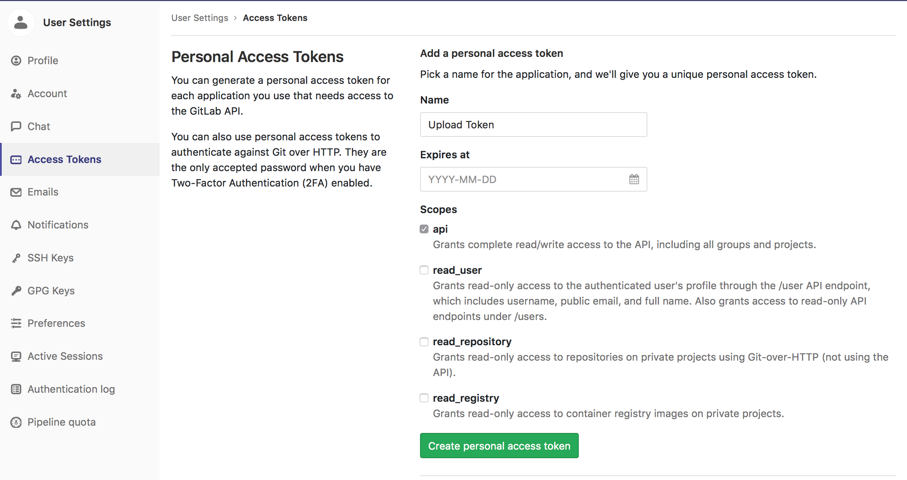
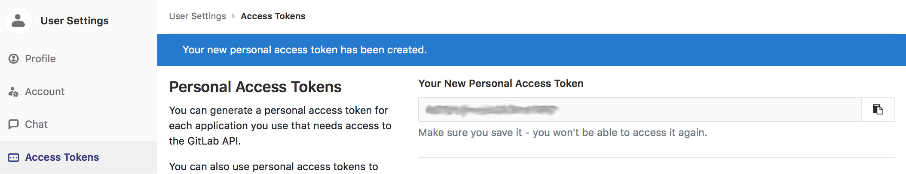

# ATLAS Analysis Repository Template

This repository is meant to serve as a starting point when writing an
analysis project in ATLAS. And as a reference when migrating existing
analysis code into a Git repository.

## Preparations

There are two things you need to prepare before first generating a
repository from this template.
  - The python modules needed to generate the repository;
  - A "token" to access https://gitlab.cern.ch with.

### Installing The Python Modules

We recommend that you install the two non-standard Python packages
that you will need using [pip](https://pypi.org/project/pip/). If you
will generate your repository on a private laptop/desktop (which we
recommend), you should be able to install the two necessary packages
([cookiecutter](https://cookiecutter.readthedocs.io/) and
[python-gitlab](https://python-gitlab.readthedocs.io/en/stable/))
using the following command:

```
pip install --user --upgrade cookiecutter python-gitlab
```

If you are on lxplus, you will have to set up a functional version of
pip first. We recommend doing this by:

```
setupATLAS
lsetup "lcgenv -p LCG_93 x86_64-slc6-gcc62-opt pip"
```

After executing these commands, you can run the `pip install` command
in the same way as was written above.

### Generating An Access Token

In order to get privileged access to https://gitlab.cern.ch, you need
to generate a "token" for your user. You do this in the following way:
  - In your favourite browser open https://gitlab.cern.ch, and log in
    with your CERN username/password (or whatever other identification
    you use);
  - Go to your user settings;



  - Here you will find a tab called "Access Tokens" on the left,
    select that;
  - Enter some reasonable name for the token to be generated, and
    select "api" as the scope for the token;



  - After pressing the "Create personal access token" button, you will
    be taken to the following page:



  - Note down the token. As the page warns you, you will not be able
    to get this token in the future in any way, so save it in a safe
    spot.

In case you do forget your token, that is also not the end of the
world. You can at any time return to this page, and generate a new
token. (At the same time you should also delete the token that you no
longer use.)

## Personalising The Repository

The previous commands should have put the `cookiecutter` executable
under `~/.local/bin/cookiecutter` on SLC6 (and other linux flavours),
and under `~/Library/Python/2.7/bin/cookiecutter` on macOS.

With that executable you can generate a GitLab project from the
template with the following command, preferably in an empty/temporary
directory:

```
<somewhere>/cookiecutter https://:@gitlab.cern.ch:8443/atlas-asg/AnalysisRepositoryTemplate.git
```

It will ask you a series of questions that you need to provide answers
for, based on the [cookiecutter.json](cookiecutter.json) file of the
template. This will include the token that you have gotten from GitLab
during the preparations. Based on all of this information it will:
  - Generate a subdirectory (under `$PWD`) with the name that you
    specified as the `project_name` variable;
  - Run a script
    ([hooks/post_gen_project.py](hooks/post_gen_project.py)) that
    creates the repository in GitLab, and uploads all the generated
    files into it.

The code generation/upload has a number of places where it could
fail. If you provide a project name that already exists, if you do not
provide a valid access token, etc. If this happens, the generated
files will still be created in your local directory, but they will
fail to get uploaded into the GitLab repository.
